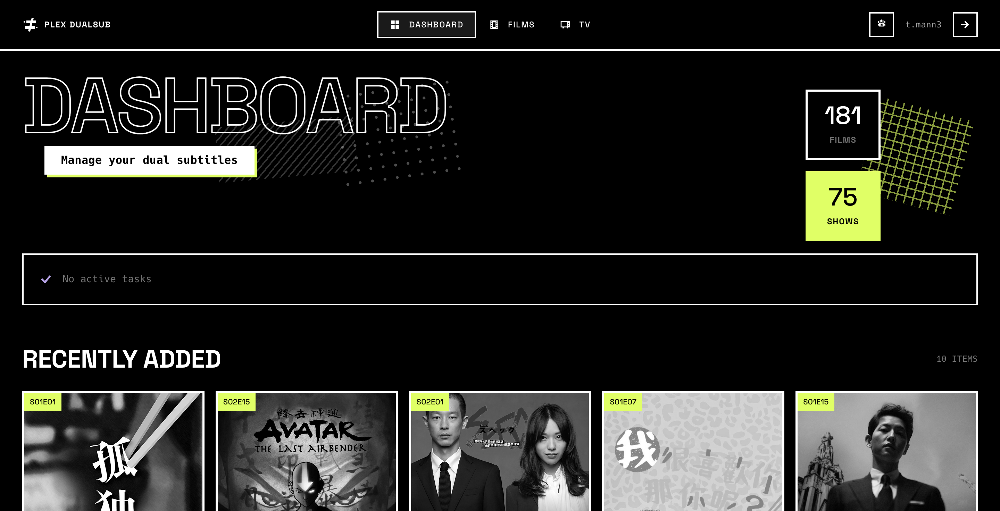
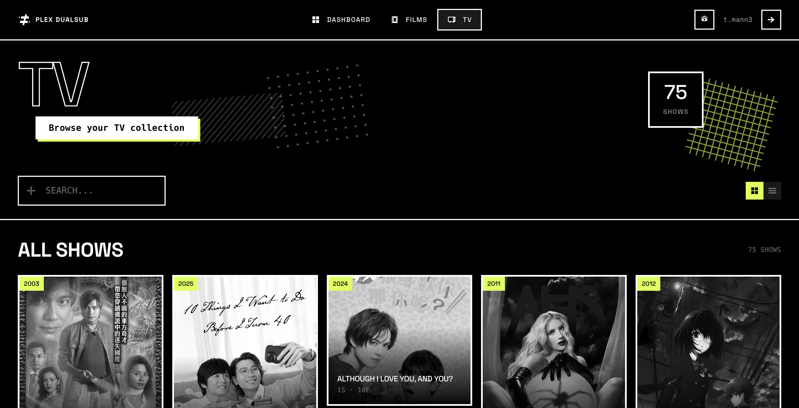
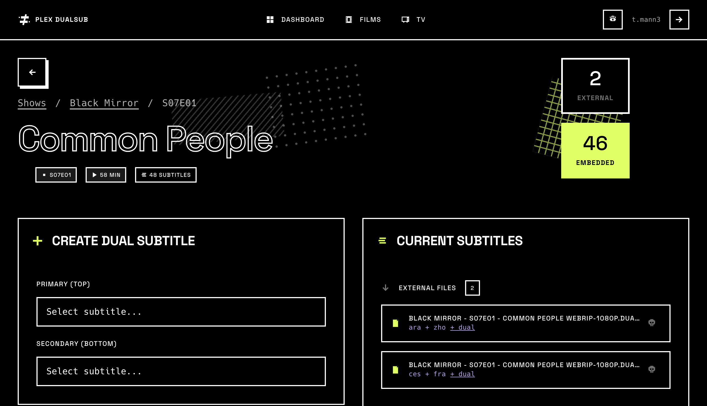
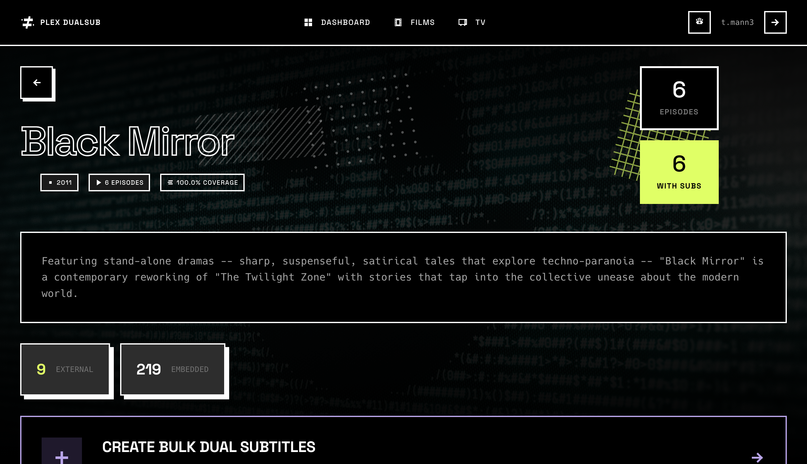
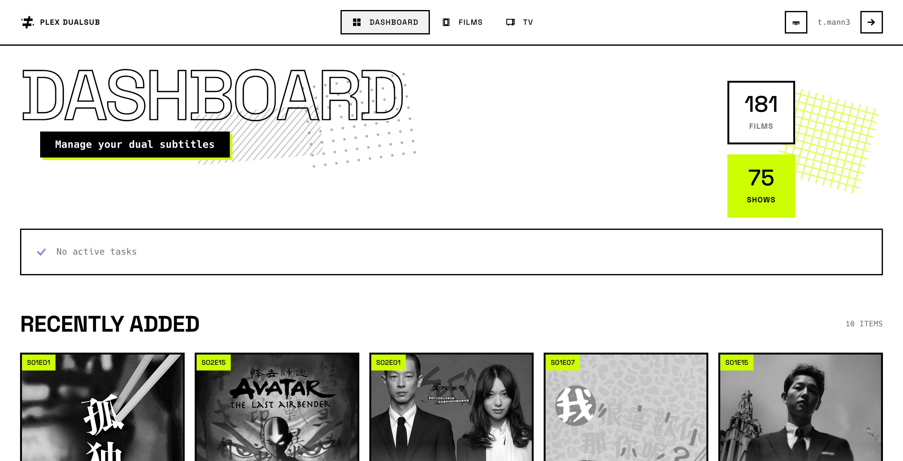
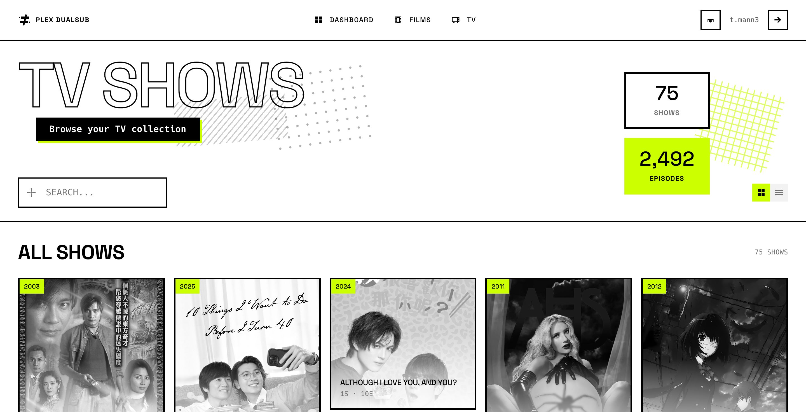
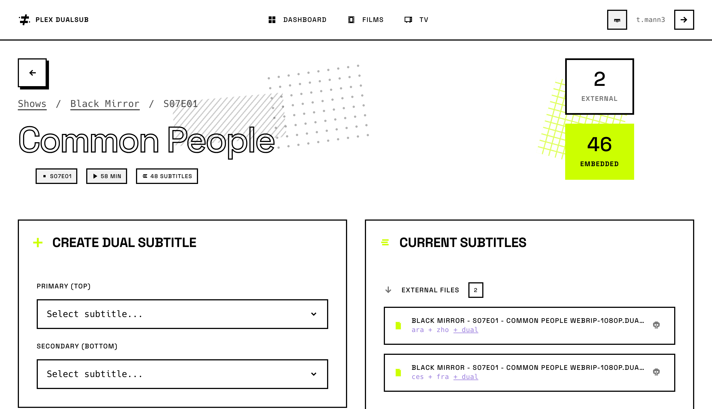
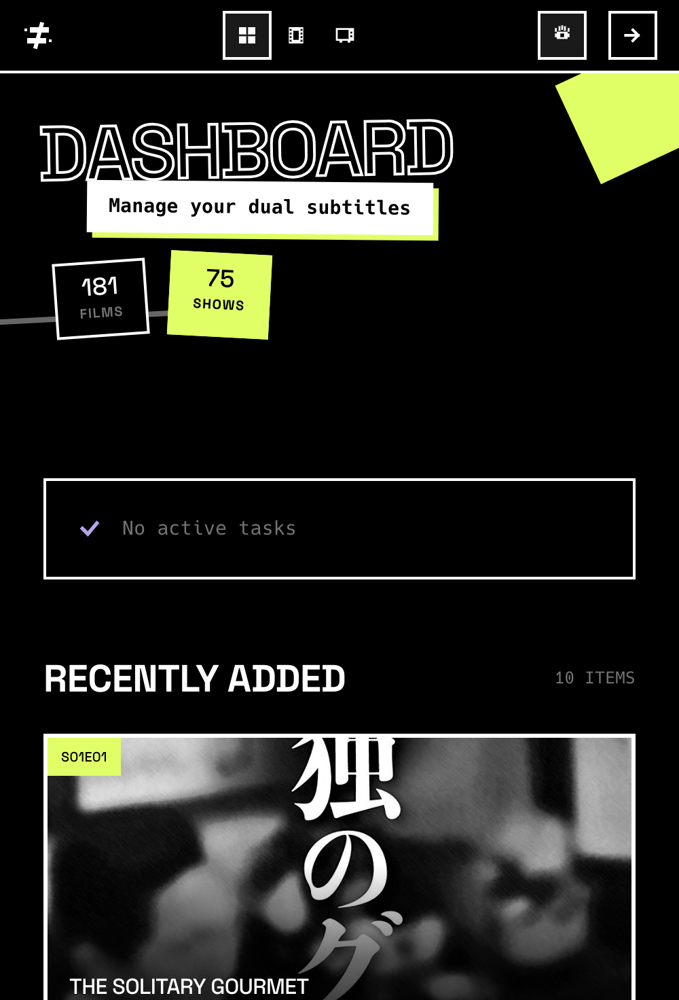
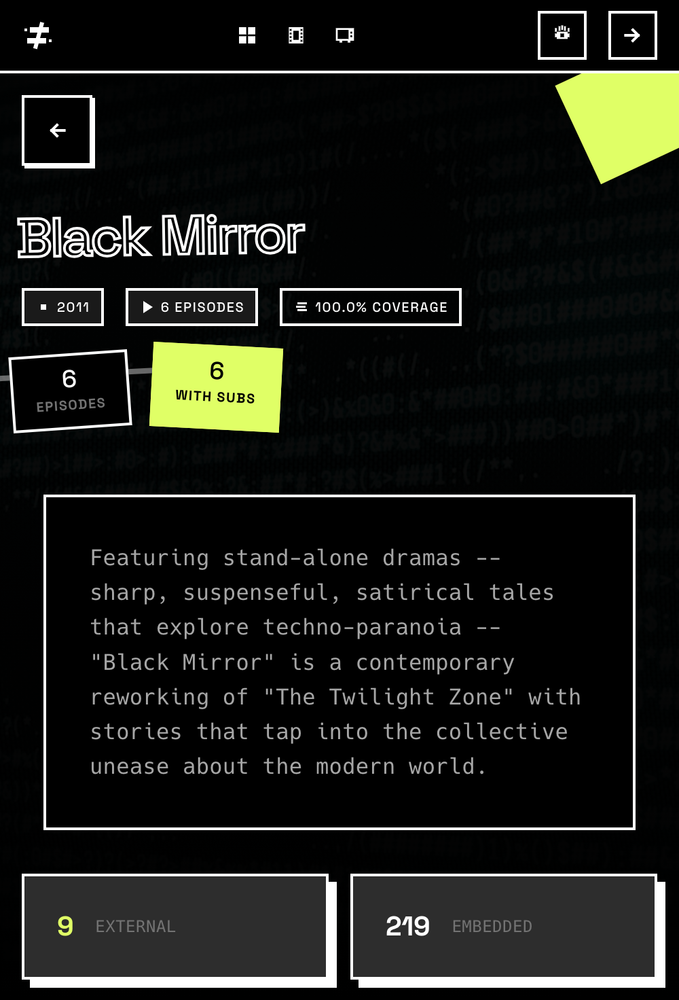
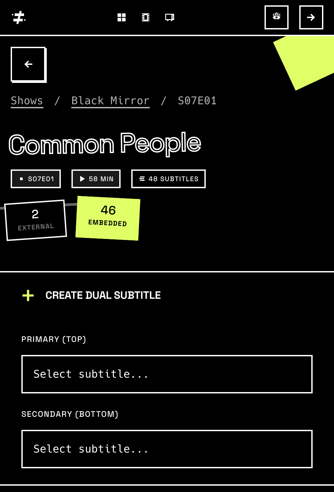

<p align="center">
  
</p>

<h1 align="center">PLEX DUAL SUB</h1>

<p align="center">
  <strong>Create dual-language subtitles for your Plex library</strong>
</p>

<p align="center">
  
  
  
  
</p>

---

## SCREENSHOTS

<table>
  <tr>
    <td colspan="2" align="center"><strong>DARK MODE</strong></td>
  </tr>
  <tr>
    <td align="center">
      
      <br><em>Dashboard</em>
    </td>
    <td align="center">
      
      <br><em>Shows Browser</em>
    </td>
  </tr>
  <tr>
    <td align="center">
      
      <br><em>Episode Detail & Subtitle Manager</em>
    </td>
    <td align="center">
      
      <br><em>Bulk Dual Subtitle Wizard</em>
    </td>
  </tr>
  <tr>
    <td colspan="2" align="center"><strong>LIGHT MODE</strong></td>
  </tr>
  <tr>
    <td align="center">
      
      <br><em>Dashboard</em>
    </td>
    <td align="center">
      
      <br><em>Shows Browser</em>
    </td>
  </tr>
  <tr>
    <td align="center" colspan="2">
      
      <br><em>Episode Detail</em>
    </td>
  </tr>
</table>

<details>
<summary><strong>MOBILE VIEWS</strong></summary>
<br>
<table>
  <tr>
    <td align="center" width="33%">
      
      <br><em>Dashboard</em>
    </td>
    <td align="center" width="33%">
      
      <br><em>Shows Browser</em>
    </td>
    <td align="center" width="33%">
      
      <br><em>Episode Detail</em>
    </td>
  </tr>
</table>
</details>

---

## WHAT IS PLEXDUALSUB?

PlexDualSub is a web application that connects to your local Plex Media Server and allows you to create **dual-language subtitle files** by merging two subtitle tracks into one. This is useful for:

- **Language learners** watching content with both native and target language subtitles
- **Bilingual households** where different family members prefer different languages
- **Accessibility** for viewers who benefit from seeing translations alongside original text

The app supports both **embedded subtitles** (extracted from video files) and **external subtitle files**, with automatic language detection and optional timing synchronization via ffsubsync.

---

## FEATURES

### PLEX INTEGRATION
- **OAuth Authentication** - Secure login with your Plex account
- **Library Browsing** - Browse TV shows and movies from your Plex server
- **Media Metadata** - View episode details, artwork, and existing subtitles
- **Embedded Subtitle Extraction** - Extract subtitle streams from MKV/MP4 files

### DUAL SUBTITLE CREATION
- **Merge Any Two Subtitles** - Combine embedded or external subtitle files
- **Primary/Secondary Positioning** - Top or bottom placement for each language
- **Language Prefixes** - Optional `[EN]` `[JA]` markers for clarity
- **Format Support** - Input: SRT, ASS, SSA, VTT, SUB | Output: SRT

### BULK PROCESSING
- **Process Entire Shows** - Create dual subtitles for all episodes at once
- **Background Job Queue** - Jobs run in the background with progress tracking
- **Smart Detection** - Automatically finds episodes with matching language pairs
- **Resume Support** - Monitor job progress from the dashboard

### LANGUAGE DETECTION
- **Automatic Detection** - Detects language from filename patterns and content
- **CJK Optimized** - Special handling for Chinese, Japanese, and Korean
- **Script Analysis** - Distinguishes Traditional vs Simplified Chinese
- **100+ Languages** - Comprehensive language code support

### AUTO-SYNC
- **ffsubsync Integration** - Automatically synchronize misaligned subtitles
- **Hybrid Sync** - Primary syncs to video, secondary syncs to primary (faster)
- **Fallback Safety** - Falls back to original timing if sync fails
- **Optional** - Can be disabled for already-synced files

### BRUTALIST UI
- **Modern Design** - Stark, functional interface with monochrome palette
- **Dark/Light Themes** - Full support for both with system preference detection
- **Responsive Layout** - Works on desktop, tablet, and mobile devices
- **Hard Shadows** - Bold visual style with thick borders and offset shadows

---

## TECH STACK

### Backend

| Component | Technology |
|-----------|------------|
| **Framework** | FastAPI 0.109 |
| **Server** | Uvicorn |
| **Plex API** | plexapi 4.15 |
| **Subtitle Processing** | pysubs2 1.6 |
| **Subtitle Sync** | ffsubsync 0.4 |
| **Language Detection** | langdetect + custom CJK |
| **Encoding Detection** | chardet |
| **Configuration** | Pydantic Settings |

### Frontend

| Component | Technology |
|-----------|------------|
| **Framework** | React 19 |
| **Language** | TypeScript 5.8 |
| **Build Tool** | Vite 7 |
| **State Management** | TanStack Query 5 |
| **HTTP Client** | Axios |
| **Auth** | plex-oauth |
| **Routing** | React Router 7 |

### Design System

| Element | Style |
|---------|-------|
| **Aesthetic** | Brutalist |
| **Colors** | Monochrome + Neon/Lilac accents |
| **Typography** | Space Grotesk (headings) + Hack (body) |
| **Borders** | 2-4px solid, sharp corners |
| **Shadows** | Hard-edged offset (4-8px) |
| **Spacing** | 8px base grid |

---

## QUICK START

### Prerequisites

- **Python 3.8+**
- **Node.js 18+**
- **ffmpeg** (for subtitle extraction and sync)
- **Plex Media Server** running locally or on network

### Installation

```bash
# Clone the repository
git clone https://github.com/yourusername/PlexDualSub.git
cd PlexDualSub

# Run the setup script
./setup.sh

# Or manually:
python3 -m venv venv
source venv/bin/activate
pip install -r requirements.txt
cd frontend && npm install && cd ..
```

### Configuration

Create a `.env` file from the example:

```bash
cp .env.example .env
```

Edit `.env` with your Plex details:

```bash
# Required
PLEX_URL=http://localhost:32400
PLEX_TOKEN=your_plex_token_here

# Optional
PLEX_SERVER_NAME=My Plex Server
PLEX_TV_LIBRARY=TV Shows
```

> **Finding your Plex token:** See [Plex Support Article](https://support.plex.tv/articles/204059436-finding-an-authentication-token-x-plex-token/)

### Running

```bash
# Start both backend and frontend
python run.py

# Or with browser auto-open
python run.py --open

# Or start individually:
# Terminal 1: Backend
source venv/bin/activate && cd backend && python main.py

# Terminal 2: Frontend
cd frontend && npm run dev
```

Access the app at **http://localhost:5173**

---

## USAGE GUIDE

### Browsing Your Library

1. Navigate to **Shows** or **Movies** from the navigation bar
2. Browse your Plex library content displayed in a grid
3. Click on any show to see seasons and episodes
4. Click on an episode or movie to access subtitle management

### Creating a Dual Subtitle

1. Open an episode or movie detail page
2. View available subtitles in the **Current Subtitles** section:
   - `[EXT]` = External file in media folder
   - `[EMB]` = Embedded stream in video file
3. In the **Create Dual Subtitle** card:
   - Select **Primary (Top)** subtitle - typically native language
   - Select **Secondary (Bottom)** subtitle - typically target/translation
4. Configure options:
   - **Auto-sync timing** - Enable if subtitles are misaligned
   - **Show language prefixes** - Adds `[EN]` `[JA]` markers
5. Click **Create Dual Subtitle**
6. New file appears in Current Subtitles as `*.dual.{lang1}-{lang2}.srt`

### Bulk Processing a Show

1. Navigate to a show's detail page
2. Click **Bulk Create Dual Subtitles** button
3. **Step 1 - Language Discovery:**
   - System analyzes all episodes for available languages
   - Select primary and secondary languages
4. **Step 2 - Episode Configuration:**
   - Review which episodes have both required languages
   - Configure styling options in the sidebar
5. **Step 3 - Processing:**
   - Click **Start Processing**
   - Job runs in background
6. **Step 4 - Complete:**
   - View job results
   - Monitor from dashboard if needed

### Uploading External Subtitles

1. Open episode or movie detail page
2. In the **Upload Subtitle** card:
   - Drag and drop a subtitle file, or click to browse
   - Supported formats: `.srt`, `.ass`, `.vtt`, `.sub`
3. Language is auto-detected from filename
4. Adjust language if needed, then click **Upload**
5. File appears in Current Subtitles immediately

### Extracting Embedded Subtitles

1. View embedded subtitles in Current Subtitles section
2. Click the **Extract** button next to any embedded stream
3. System extracts to external SRT file
4. Extracted file now available for dual subtitle creation

---

## CONFIGURATION

### Environment Variables

| Variable | Required | Default | Description |
|----------|----------|---------|-------------|
| `PLEX_URL` | Yes | - | Plex server URL (e.g., `http://localhost:32400`) |
| `PLEX_TOKEN` | Yes | - | Your Plex authentication token |
| `PLEX_SERVER_NAME` | No | - | Server name for MyPlex discovery |
| `PLEX_TV_LIBRARY` | No | `TV Shows` | Name of TV library in Plex |
| `API_HOST` | No | `0.0.0.0` | Backend API host |
| `API_PORT` | No | `8000` | Backend API port |
| `API_RELOAD` | No | `false` | Enable auto-reload for development |

### Default Subtitle Settings

The backend uses sensible defaults for subtitle processing:

| Setting | Default |
|---------|---------|
| Primary Language | Japanese (`ja`) |
| Secondary Language | English (`en`) |
| Sync Timeout | 120 seconds |
| Output Format | SRT |
| Language Prefixes | Disabled |
| Auto-sync | Enabled |

---

## API REFERENCE

The backend provides a RESTful API. Full interactive documentation available at `http://localhost:8000/docs` when running.

### Key Endpoints

#### Libraries
```
GET /api/libraries              # List all Plex libraries
GET /api/libraries/recently-added  # Recently added content
```

#### Shows
```
GET /api/shows                  # List TV shows (supports pagination)
GET /api/shows/{id}/seasons     # Get show seasons
GET /api/shows/{id}/episodes    # Get show episodes
```

#### Episodes
```
GET /api/episodes/{id}          # Episode details
GET /api/episodes/{id}/subtitles  # Available subtitles
POST /api/episodes/{id}/subtitles/upload  # Upload subtitle
POST /api/episodes/{id}/subtitles/dual    # Create dual subtitle
POST /api/episodes/{id}/subtitles/extract-embedded  # Extract embedded
```

#### Movies
```
GET /api/movies                 # List movies
GET /api/movies/{id}            # Movie details
GET /api/movies/{id}/subtitles  # Available subtitles
POST /api/movies/{id}/subtitles/dual  # Create dual subtitle
```

#### Jobs
```
GET /api/jobs                   # List all jobs (supports ?status= filter)
GET /api/jobs/{id}              # Job details with progress
POST /api/jobs/{id}/cancel      # Cancel running job
POST /api/jobs/bulk-dual-subtitle  # Create bulk job
```

---

## ARCHITECTURE

### Project Structure

```
PlexDualSub/
├── backend/
│   ├── app.py                 # FastAPI application factory
│   ├── main.py                # Entry point (uvicorn)
│   ├── config.py              # Pydantic settings
│   ├── routes/                # API endpoints
│   │   ├── libraries.py       # Library browsing
│   │   ├── shows.py           # TV show endpoints
│   │   ├── episodes.py        # Episode endpoints
│   │   ├── movies.py          # Movie endpoints
│   │   ├── subtitles.py       # Subtitle operations
│   │   └── jobs.py            # Job queue management
│   └── services/              # Business logic
│       ├── plex_service.py    # Plex API integration
│       ├── subtitle_service.py  # Subtitle processing
│       ├── subtitle_sync.py   # ffsubsync integration
│       ├── language_detector.py  # Language detection
│       ├── job_queue.py       # Background jobs
│       └── bulk_processor.py  # Batch processing
│
├── frontend/
│   ├── src/
│   │   ├── pages/             # Route pages
│   │   │   ├── Dashboard.tsx
│   │   │   ├── Shows.tsx
│   │   │   ├── ShowDetail.tsx
│   │   │   ├── EpisodeDetail.tsx
│   │   │   ├── Movies.tsx
│   │   │   └── MovieDetail.tsx
│   │   ├── components/        # React components
│   │   │   ├── DualSubtitleCreator.tsx
│   │   │   ├── SubtitleManager.tsx
│   │   │   ├── bulk/          # Bulk wizard steps
│   │   │   ├── jobs/          # Job monitoring
│   │   │   └── media/         # Media cards/grids
│   │   ├── styles/            # Brutalist design system
│   │   │   └── design-system/
│   │   │       ├── tokens.css
│   │   │       └── components/
│   │   ├── lib/api.ts         # Axios API client
│   │   └── contexts/          # Auth & Theme contexts
│   └── vite.config.ts
│
├── run.py                     # Unified launcher
├── setup.sh                   # Installation script
├── requirements.txt           # Python dependencies
└── .env.example               # Environment template
```

### Data Flow

```
┌─────────────────────────────────────────────────────────────┐
│                        FRONTEND                              │
│  React 19 + TypeScript + TanStack Query + Brutalist CSS     │
└─────────────────────────────────────────────────────────────┘
                              │
                              ▼ HTTP (Axios)
┌─────────────────────────────────────────────────────────────┐
│                        BACKEND                               │
│                   FastAPI + Uvicorn                          │
│  ┌─────────────┐  ┌─────────────┐  ┌─────────────────────┐  │
│  │   Routes    │  │  Services   │  │    Job Queue        │  │
│  │ (REST API)  │──│ (Business)  │──│ (Background Tasks)  │  │
│  └─────────────┘  └─────────────┘  └─────────────────────┘  │
└─────────────────────────────────────────────────────────────┘
                              │
          ┌───────────────────┼───────────────────┐
          ▼                   ▼                   ▼
    ┌──────────┐       ┌──────────┐       ┌──────────┐
    │   Plex   │       │  pysubs2 │       │ffsubsync │
    │   API    │       │ (parser) │       │  (sync)  │
    └──────────┘       └──────────┘       └──────────┘
          │
          ▼
    ┌──────────┐
    │  Media   │
    │  Files   │
    └──────────┘
```

---

## DEVELOPMENT

### Running in Development Mode

```bash
# Backend with auto-reload
source venv/bin/activate
cd backend
uvicorn app:create_app --reload --host 0.0.0.0 --port 8000

# Frontend with HMR
cd frontend
npm run dev
```

### Building for Production

```bash
cd frontend
npm run build
# Output in frontend/dist/
```

### Type Checking

```bash
cd frontend
npm run build  # Includes TypeScript check
```

---

## TROUBLESHOOTING

### Port Already in Use

```bash
# Kill processes on ports 5173 and 8000
python run.py --cleanup-only

# Or manually
lsof -i :5173 -i :8000
kill -9 <PID>
```

### Plex Connection Failed

- Verify Plex server is running: `http://localhost:32400/web`
- Check `PLEX_URL` in `.env` is correct
- Ensure `PLEX_TOKEN` is valid
- Try accessing from browser first

### ffsubsync Not Found

```bash
# Install ffsubsync
pip install ffsubsync

# Verify installation
ffsubsync --version
```

### Subtitle Extraction Fails

```bash
# Install ffmpeg
# macOS
brew install ffmpeg

# Ubuntu/Debian
sudo apt install ffmpeg

# Verify
ffmpeg -version
```

### Language Detection Issues

- Larger subtitle files produce better detection
- CJK detection is optimized for 50+ lines of content
- Manual language selection available as fallback
- Check filename for language codes (e.g., `.en.srt`, `.ja.srt`)

---

## LICENSE

MIT License - see [LICENSE](LICENSE) for details.

---

## ACKNOWLEDGMENTS

- **[ffsubsync](https://github.com/smacke/ffsubsync)** - Automatic subtitle synchronization
- **[pysubs2](https://github.com/tkarabela/pysubs2)** - Subtitle file processing
- **[PlexAPI](https://github.com/pkkid/python-plexapi)** - Plex server integration
- **[FastAPI](https://fastapi.tiangolo.com/)** - Modern Python web framework
- **[React](https://react.dev/)** - UI component library
- **[Vite](https://vitejs.dev/)** - Frontend build tool
